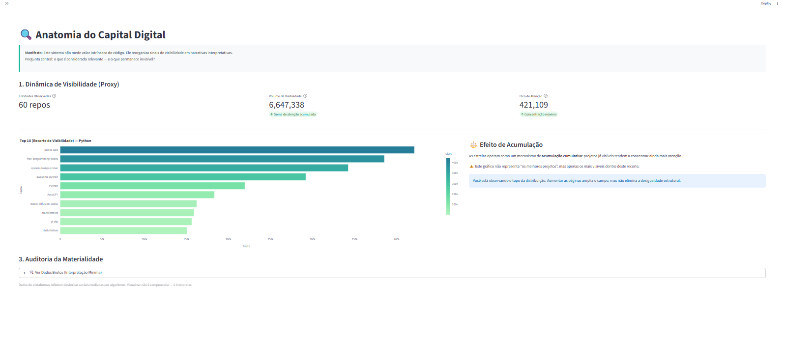
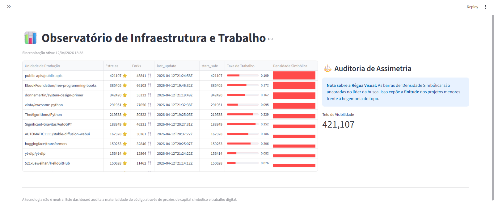
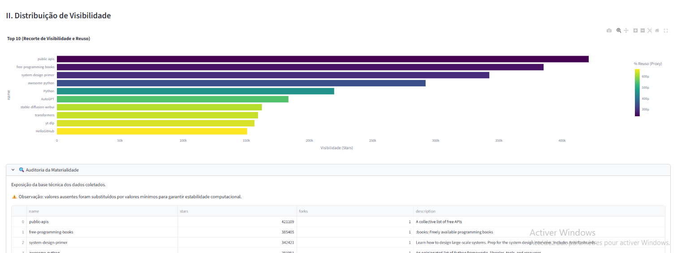
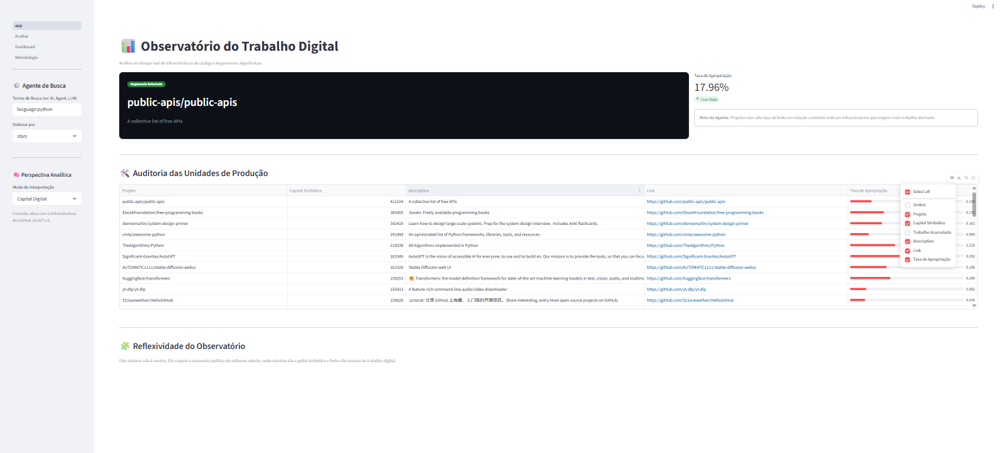
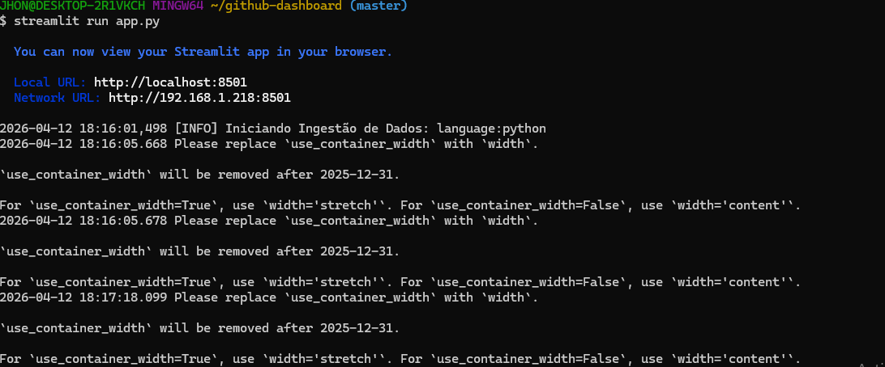

 📊 GitHub Analytics Dashboard

Interactive data analytics dashboard built with **Python**, **Streamlit**, and **Plotly** to explore and visualize GitHub repository data.


 🚀 Overview

This project provides an interactive interface for analyzing GitHub data, enabling users to explore repository trends, rankings, and activity through dynamic visualizations.

Designed as a hands-on data project, it combines:

* 📊 Data visualization
* ⚡ Interactive dashboards
* 🧠 Analytical exploration
* 🏗️ Modular Python architecture


 📸 Dashboard Preview

 🔹 Main Dashboard




 🔹 Data Analysis



---

 🔹 Methodology




 🔹 App Navigation




 ⚙️ Running the Application

Run the Streamlit app locally:

```bash
streamlit run app.py
```

 🔹 Execution Preview




 🧩 Project Structure

```
github-analytics-dashboard/
│
├── app.py
├── pages/
├── utils/
├── assets/
└── README.md
```


⚙️ Technologies Used

* Python
* Streamlit
* Plotly
* Git & GitHub


 🎯 Features

* 📈 Interactive data visualizations
* ⚡ Real-time exploration
* 🧭 Multi-page navigation
* 🗂️ Modular and scalable structure


 📊 Use Cases

* GitHub repository analysis
* Data visualization learning
* Dashboard prototyping
* Portfolio project for data roles

---

 📈 Future Improvements

* 🔗 Integration with GitHub API (live data)
* ☁️ Deployment (Streamlit Cloud / Render)
* 🔄 Automated ETL pipelines
* 📊 Advanced analytics


 👨‍💻 Author

Jhon Max Polins Ribeiro
Researcher & Data Enthusiast


 🌐 Project Status

🟢 Active — continuously evolving


 ⭐ Contribution & Feedback

Feel free to fork this repository, open issues, or submit pull requests.

If you found this project useful, consider giving it a ⭐!
